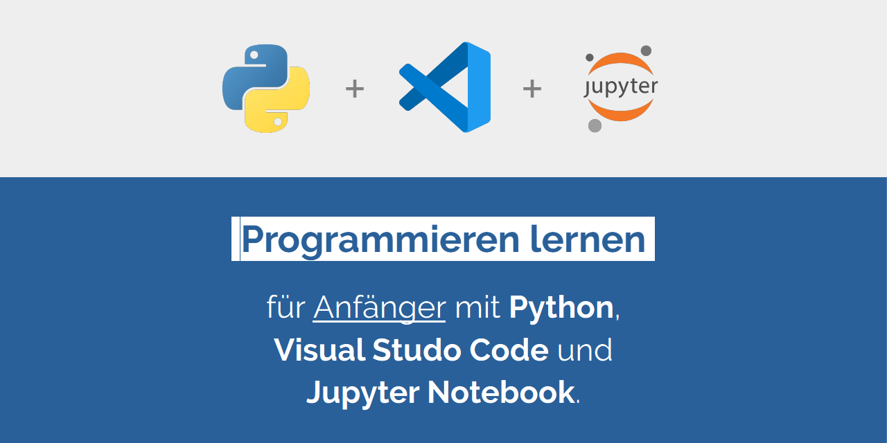

# **Python** Grundlagen Kurs

Dieses Repository enthält Unterlagen für einen Python-Kurs, den wir an der [Fakultät für Technik und angewandte Naturwissenschaften](https://www.fh-ooe.at/campus-wels/) der [Fachhochschule Oberösterreich](https://www.fh-ooe.at) für Einsteiger in unterschiedlichen Studiengängen und -richtungen unterrichten.

Dieses Dokument ist wie folgt gegliedert:

- 🎯 **Lernziele** - wann sollte ich den Kurs machen?
- ⚙️ **Vorbereitungen** - wie muss ich meine Lernumgebung einrichten?
- 📦 **Lerneinheiten** - wie ist der Ablauf des Kurses gegliedert?

## 🎯 Lernziele

Der Kurs hat die folgenden Lernziele:

- Fähigkeit entwickeln, Programme in der Programmiersprache Python **lesen und interpretieren** zu können
- Fähigkeit entwickeln, einfache Programme mit der Programmiersprache Python **selbst realisieren** zu können

## ⚙️ Vorbereitungen

So richtest du deine Lernumgebung ein:

1. **[Python installieren](./Vorbereitungen/01_Python/README.md)**
1. **[Visual Studio Code installieren](./Vorbereitungen/02_Visual_Studio_Code/README.md)**
1. **[Visual Studio Code Erweiterungen installieren](./Vorbereitungen/03_Visual_Studio_Code_Erweiterungen/README.md)**
1. **[Jupyter Kernel installieren](./Vorbereitungen/04_Jupyter_Kernel/README.md)**

## 📋 Lerneinheiten

Der Kurs umfasst die folgenden Lerneinheiten:

1. **[Hardware Grundlagen](./Lerneinheiten/Einheit_01/README.ipynb)**
   - **Computer**
     - Von-Neumann-Architektur
     - Von-Neumann-Zyklus
   - **Befehle**
     - Speicherbefehle
     - Logische Befehle
     - Arithmetische Befehle
     - Sprungbefehle
   - **Daten**
     - Wahrheitswerte
     - Zahlen
     - Zeichenketten
   - **Programme**
     - Grundlegende Programmdefinition
     - Erweiterte Programmdefinition
     - Allgemeine Programmdefinition
1. **[Grundlegende Syntax und Semantik](./Lerneinheiten/Einheit_02/README.ipynb)**
   - **Kommentare**
     - ``# ...``
   - **Literale**
     - ``True`` und `False`
     - `5`, `5.5` und `5.5j`
     - `"..."` und `'...'`
   - **Operatoren**
     - ``not ...``, ``... and ...`` und ``... or ...``
     - ``... + ...``, `... - ...`, ``... * ...``, `... / ...`, `... // ...` und `... % ...`
     - ``"..." + "..."``, ``f"..."`` und ``"..."[...]``
   - **Klammerungen**
     - ``(... + ...) * ...``
     - ``... * (... + ...)``
   - **Variablen**
     - ``x = ...``
   - **Funktionen**
     - Typbesetimmung: ``type(...)``
     - Typkonvertierung: ``bool(...)``, ``int(...)``, ``float(...)``, ``complex(...)``, ``str(...)``
     - Eingabe/Ausgabe: ``print(...)``, ``input(...)``
   - **Objekte**
     - Eigenschaften
     - Methoden
1. **[Komplexe Datentypen und Operatoren](./Lerneinheiten/Einheit_04/README.ipynb)**
   - **Sequenzen**
     - Datensequenzen:
       - ``[...]``
       - ``tuple([...])``
       - ``range(...)``
     - Bytesequenzen:
       - ``bytes(...)``
       - `bytearray(...)`
       - `memoryview(...)`
   - **Mengen**
     - ``set([...])``
     - ``frozenset([...])``
   - **Abbildungen**
     - ``{...}``
1. **[Verzweigungen und Schleifen](./Lerneinheiten/Einheit_05/README.ipynb)**
   - **Verzweigungen**
     - ``if ... elif ... else ...``
     - ``match ... case ...``
     - ``try ... throw ... catch ...``
   - **Schleifen**
     - ``for ...``
     - ``while ...``
1. **[Funktionen, Parameter und Rückabewerte](./Lerneinheiten/Einheit_06/README.ipynb)**
   - **Funktionsdefinitionen**
     - Signatur (Name, Parameter, Typenhinweise, Standardwerte)
     - Körper (``return ... throw ...``)
   - **Funktionsaufrufe**
     - Positionsparameter
     - Schlüsselwortparameter
     - *evtl. Rekursion*
   - **Standardfunktionen**
     - Typbesetimmung: ``type(...)``
     - Typkonvertierung: ``bool(...)``, ``int(...)``, ``float(...)``, ``complex(...)`` und ``str(...)``
     - Zahlenfunktionen: `abs(...)` und `pow(...)`
     - Eingabe/Ausgabe: ``print(...)`` und ``input(...)``
1. **[Klassen, Eigenschaften und Methoden](./Lerneinheiten/Einheit_07/README.ipynb)**
   - **Klassendefinitionen**
     - ``class X``
     - ``self.x = ...``
     - ``def __init__(self, ...)``
     - ``def x(self, ...)``
     - ``class X(Y)``
     - ``super()``
   - **Klasseninstanziierungen**
     - ``x = X(...)``
1. **[Module und Importe](./Lerneinheiten/Einheit_08/README.ipynb)**
   - **Modulmechanismus**
     - ``__init__.py``
     - ``import ...``
   - **Standardmodule**
     - `sys`
     - `os`
     - `pathlib`
     - `math`
     - `cmath`
     - `tkinter`
   - **Modulinstallation**
     - ``pip install ...``
1. **[Anwendungen](./Lerneinheiten/Einheit_09/README.ipynb)**
   - **Datenanalyse und -visualisierung**
     - ``numpy``
     - ``scipy``
     - ``pandas``
     - ``matplotlib``
   - ...