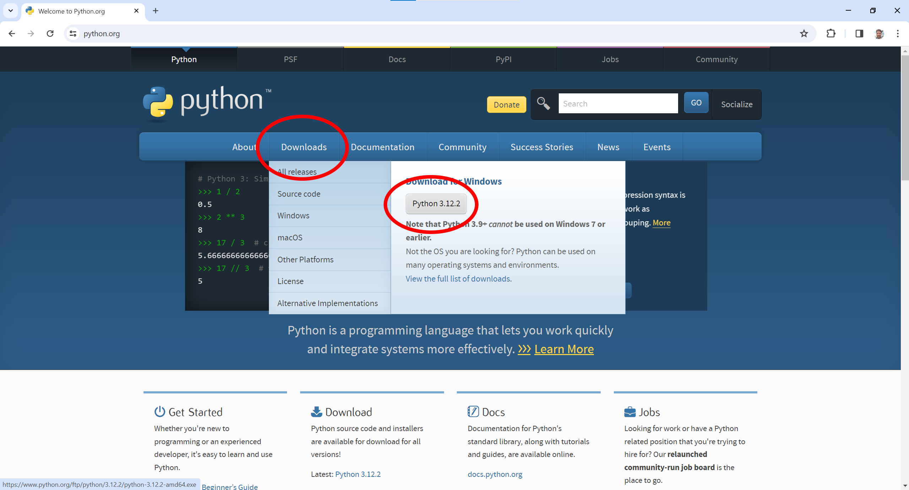
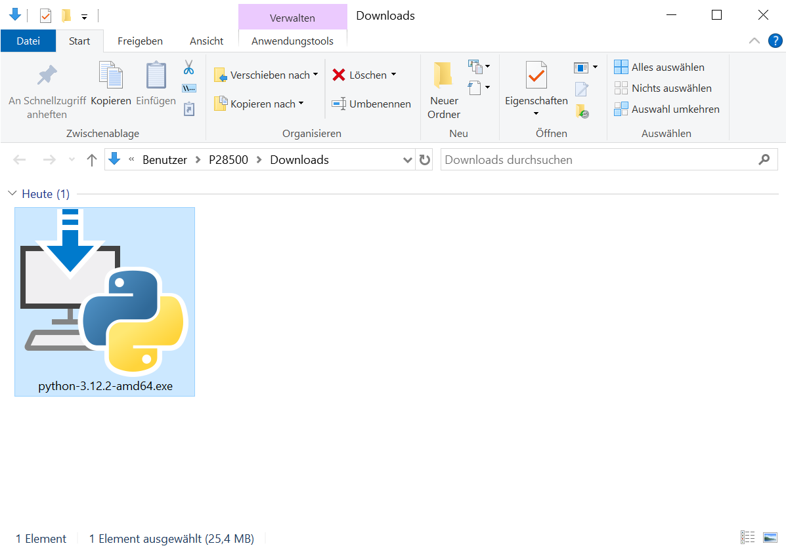

# 1. Python installieren

## 1.1. Python Installer herunterladen

Gehe auf die Python Webseite (siehe https://www.python.org/) und lade dir den Installer für das aktuelle Python Release herunter.

## 1.2. Python Installer ausführen

Gehe in dein Downloadverzeichnis, starte den Python Installer und führe die einzelnen Installationsschritte aus.

## Nächster Schritt

**[2. Visual Studio Code installieren](../02_Visual_Studio_Code/README.md)**