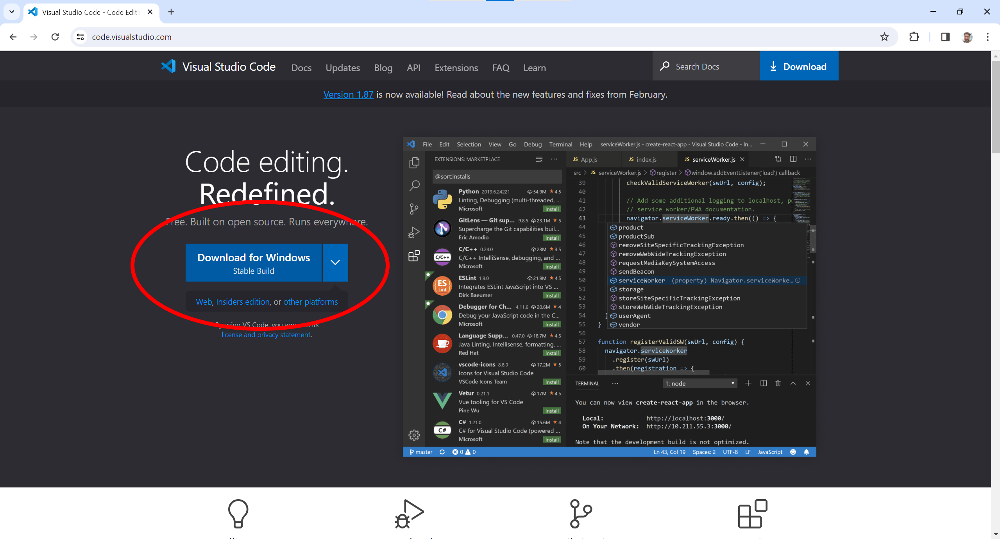
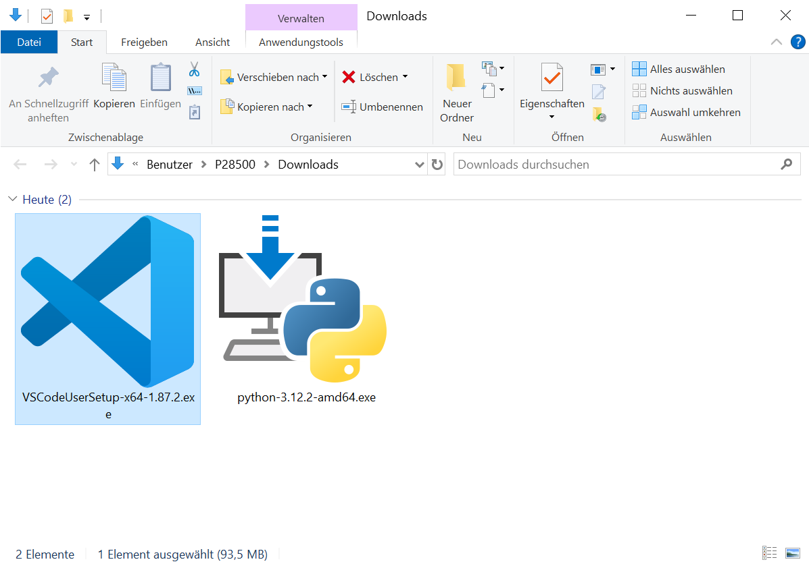

# 2. Visual Studio Code installieren

## 2.1. Visual Studio Code Installer herunterladen

Gehe auf die Webseite von Visual Studio Code (siehe https://code.visualstudio.com/) und lade den Installer für das aktuelle Release herunter.

## 2.2. Visual Studio Code Installer ausführen

Gehe in dein Downloadverzeichnis, starte den Visual Studio Code Installer und führe die einzelnen Installationsschritte aus.

## Nächster Schritt

**[3. Visual Studio Code Erweiterungen installieren](../03_Visual_Studio_Code_Erweiterungen/README.md)**