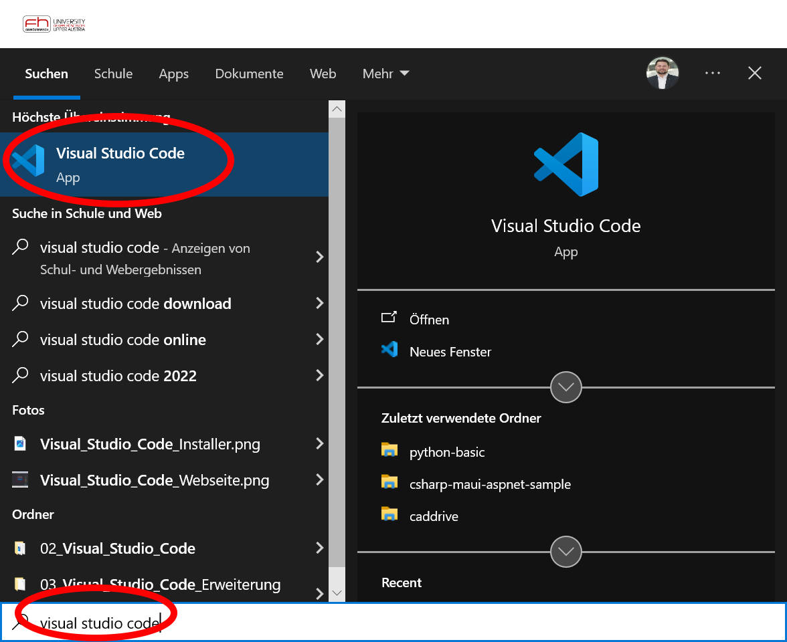
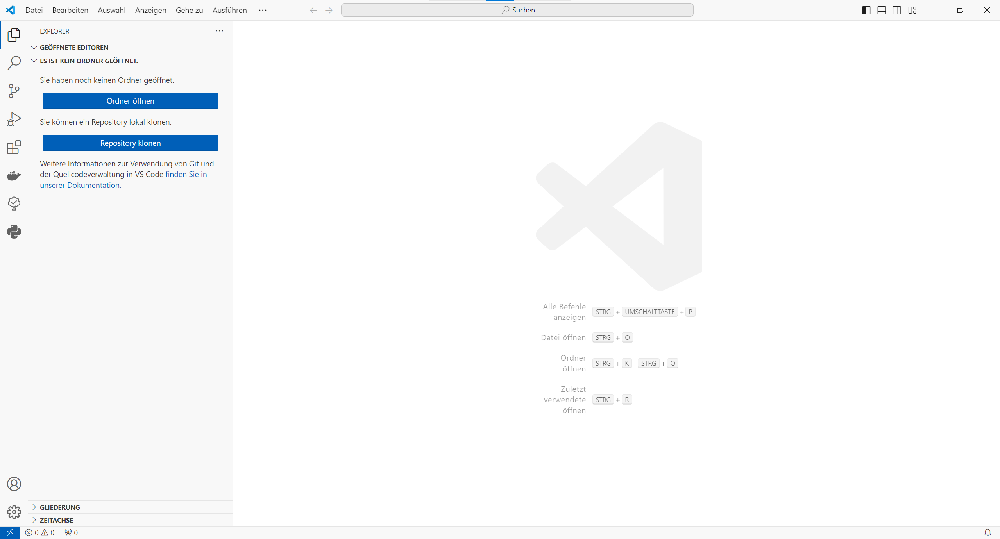
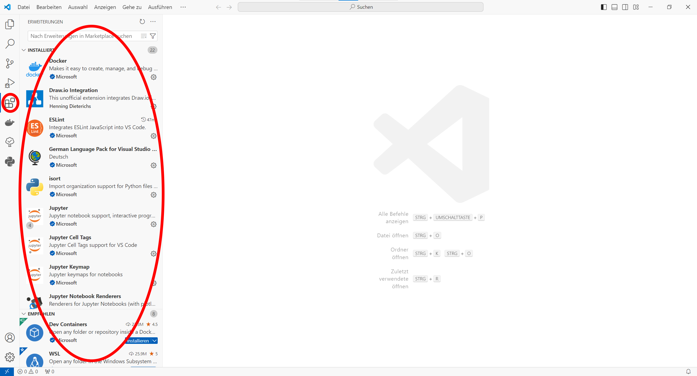
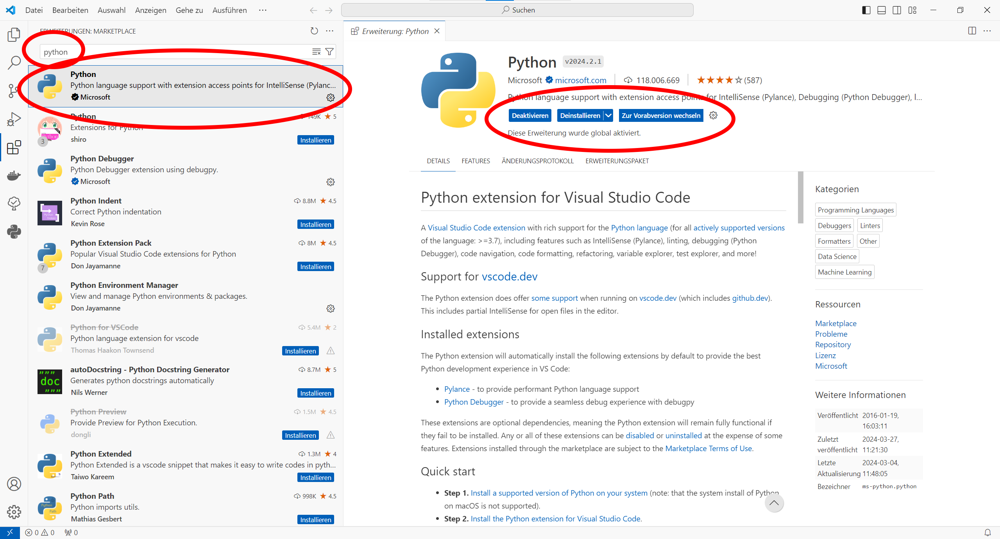
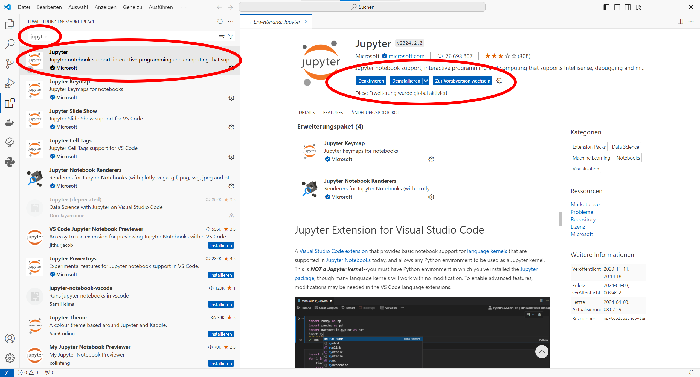

# 3. Visual Studio Erweiterungen installieren

## 3.1. Visual Studio Code starten

Suche im Windows Startmenü nach Visual Studio Code und starte die Applikation wie von anderen Applikationen gewohnt.

Danach sollte in etwa folgender Bildschirm zu sehen sein. Das Farbschema ist aber vermutlich ein anderes. Außerdem sind in der gezeigten Visual Studio Code Instanz bereits einige Erweiterungen installiert, welche die Benutzerschnittstelle leicht verändern.

## 3.2. Visual Studio Code Erweiterungen öffnen

Nun ist es an der Zeit, zwei wichtige Erweiterungen für Visual Studio Code zu installieren. Gehe dazu auf den Erweiterungs-Tab. Über den Erweiterungs-Tab kannst du die installierten Erweiterungen verwalten sowie neue Erweiterungen suchen und installieren. Du kannst auch Empfehlungen für neue Erweiterungen erhalten. Die Empfehlungen werden unter anderem anhand deiner Projektdateien generiert.

## 3.3. Visual Studio Code Erweiterung für Python installieren

Zunächst installieren wir eine Erweiterung für die Programmiersprache Python (siehe https://marketplace.visualstudio.com/items?itemName=ms-python.python). Gebe dazu den Begriff ``python`` in das obere linke Suchfeld ein und wähle die Python Erweiterung von Microsoft aus. Prüfe dann, ob die Erweiterung bereits installiert ist und installiere sie gegebenenfalls.

## 3.4. Visual Studio Code Erweiterung für Jupyter installieren

Danach installieren wir eine Erweiterung für die Erstellung von Jupyter Notebooks (siehe https://jupyter.org/ und https://marketplace.visualstudio.com/items?itemName=ms-toolsai.jupyter). Gebe dazu den Begriff ``jupyter`` in das obere linke Suchfeld ein und wähle die Jupyter Erweiterung von Microsoft aus. Prüfe dann, ob die Erweiterung bereits installiert ist und installiere sie gegebenenfalls.

## Nächster Schritt

**[4. Jupyter Kernel installieren](../04_Jupyter_Kernel/README.md)**